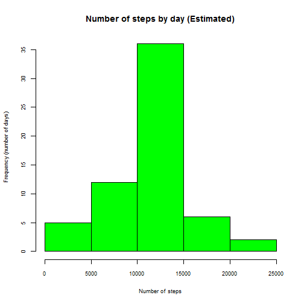

## Reproducible Research: Peer Assessment 1
#### Loading and preprocessing the data

```r
# let's unzip and load the CSV file
unzip(zipfile="activity.zip")
data <- read.csv('activity.csv', sep=',', header=TRUE)
# Are the data types of the columns correct?
str(data)
```

```
## 'data.frame':	17568 obs. of  3 variables:
##  $ steps   : int  NA NA NA NA NA NA NA NA NA NA ...
##  $ date    : Factor w/ 61 levels "2012-10-01","2012-10-02",..: 1 1 1 1 1 1 1 1 1 1 ...
##  $ interval: int  0 5 10 15 20 25 30 35 40 45 ...
```

```r
# the 'date' column is of type factor...let's change that to date
data$date <- as.Date(data$date, format = "%Y-%m-%d")
str(data)
```

```
## 'data.frame':	17568 obs. of  3 variables:
##  $ steps   : int  NA NA NA NA NA NA NA NA NA NA ...
##  $ date    : Date, format: "2012-10-01" "2012-10-01" ...
##  $ interval: int  0 5 10 15 20 25 30 35 40 45 ...
```

#### What is mean total number of steps taken per day?

```r
# first we aggregate the steps by day (summing them in the process) and change the columns headers back to the original
meanStepsByDay <- aggregate(data$steps ~ data$date, data, sum)
colnames(meanStepsByDay) <- c('date','steps')
# we can now plot the histogram
hist(meanStepsByDay$steps, col='green', cex.axis = 0.75, cex.lab = 0.75, main = 'Number of steps by day', xlab = 'Number of steps', ylab = 'Frequency (number of days)', )
```

 

```r
# this has nothing to do with the exercise, it's simply to prevent knitr from rounding the summary results
options(digits = 7)

# calculating the mean an median...a simple summary will do!
summary(meanStepsByDay$steps)
```

```
##    Min. 1st Qu.  Median    Mean 3rd Qu.    Max. 
##      41    8841   10760   10770   13290   21190
```

So the **mean** of the total number of steps taken per day is 10770, while the **median** is 10760.

#### What is the average daily activity pattern?

```r
# first we aggregate the steps by interval and calculate it's mean
meanStepsByInterval <- aggregate(data$steps ~ data$interval, data, mean)
# change the columns headers back to the original
colnames(meanStepsByInterval) <- c('interval','steps')
# we can now plot the time series 
plot(meanStepsByInterval$interval, meanStepsByInterval$steps, type='l', cex.axis = 0.75, cex.lab = 0.75, ylab='Steps (Avg)', xlab='Interval', main = 'Avg Steps by Interval')
```

 

```r
# let's figure out which interval has the higher number of steps
maxNumberSteps <- meanStepsByInterval[which.max(meanStepsByInterval$steps),]
```

The interval with the higher number of steps is **835** with **206.17** steps.

#### Imputing missing values

We're going to fill the NA's with the mean steps by interval that we calculated above (the `meanStepsByInterval` data frame).

So for each row where steps = NA, we´ll insert the mean steps for the corresponding interval.


```r
# let's clone our data set
dataEstimated <- data
# we'll now cycle the data set to replace the NA values
for (i in 1:nrow(dataEstimated)) {
      if(is.na(dataEstimated[i,'steps'])) { # if row has NA
            rowInterval <- dataEstimated[i,'interval'] # get it's interval value
            estimatedStepsValue <- meanStepsByInterval[meanStepsByInterval$interval == rowInterval,]$steps # use that value as a selector to get the mean steps
            dataEstimated[i,'steps'] <- estimatedStepsValue #write that mean steps to the row being evaluated
      }   
}
# how many rows still have NA's?
nrow(dataEstimated[is.na(dataEstimated$steps),])
```

```
## [1] 0
```

No NA's found. Let's procceed and perform the same calculations performed in the *What is mean total number of steps taken per day?* section above, but using our estimated data set.


```r
# first we aggregate the steps by day and change the columns headers back to the original
meanStepsByDayEstimated <- aggregate(dataEstimated$steps ~ dataEstimated$date, dataEstimated, sum)
colnames(meanStepsByDayEstimated) <- c('date','steps')
# we can now plot the histogram
hist(meanStepsByDayEstimated$steps, col='green', cex.axis = 0.75, cex.lab = 0.75, main = 'Number of steps by day (Estimated)', xlab = 'Number of steps', ylab = 'Frequency (number of days)')
```

 

```r
# calculating the mean an median...a simple summary will do!
summary(meanStepsByDayEstimated$steps)
```

```
##    Min. 1st Qu.  Median    Mean 3rd Qu.    Max. 
##      41    9819   10770   10770   12810   21190
```

So the **mean** of the total number of steps taken per day is 10770, while the **median** is also 10770.

- *What is the impact of imputing missing data on the estimates of the total
daily number of steps?*

Actually there's not a noticeable impact, at least by using the chosen approach to imput missing data.

#### Are there differences in activity patterns between weekdays and weekends?

> Note: my instalation of R is using my locale (Portuguese). So, in the code, where you see 'sábado' or 'domingo', you should read 'saturday' and 'sunday'.


```r
# let's create a function to determine if it is a weekend or not
isWeekend <- function(x) {
      if( x == "sábado" || x == "domingo") "weekend" else "weekday";
}
# let's create the new column in our data set
dataEstimated['WeekPeriod'] <- NULL
# use the function above to determine if it is a weekend or not
dataEstimated$WeekPeriod <- lapply(weekdays(dataEstimated$date), isWeekend) 
# set the column data type to factor and confirm the change
dataEstimated$WeekPeriod <- sapply(dataEstimated$WeekPeriod, as.factor)
str(dataEstimated)
```

```
## 'data.frame':	17568 obs. of  4 variables:
##  $ steps     : num  1.717 0.3396 0.1321 0.1509 0.0755 ...
##  $ date      : Date, format: "2012-10-01" "2012-10-01" ...
##  $ interval  : int  0 5 10 15 20 25 30 35 40 45 ...
##  $ WeekPeriod: Factor w/ 2 levels "weekday","weekend": 1 1 1 1 1 1 1 1 1 1 ...
```

Let's create our panel plot:


```r
library("lattice")

xyplot( steps~interval | dataEstimated$WeekPeriod, data=dataEstimated, type="l", layout=c(1,2), main = 'Avg Steps by Interval, by week period', xlab='Interval', ylab='Avg Steps')
```

 
